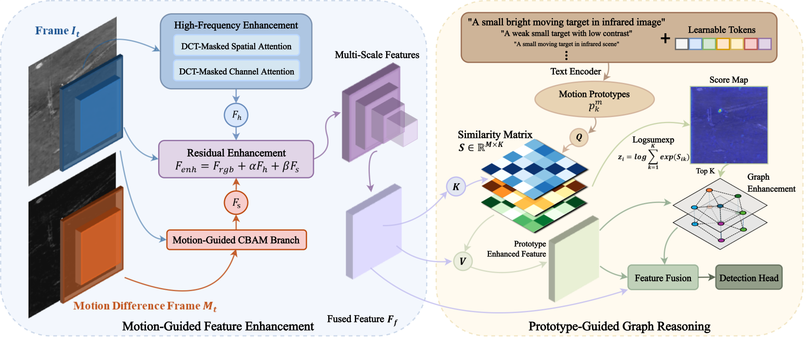

# MPR-Net: Learning from Target-Like Candidates — Motion Prototype Reasoning for Moving Infrared Small Target Detection

Official implementation of

> **Learning from Target-Like Candidates: Motion Prototype Reasoning for Moving Infrared Small Target Detection**
> Bolin Wan, Mao Ye\*, Yuchen He, Hu Wang, Yuman Wang, Dengyan Luo, Luping Ji
> *IEEE Transactions on Geoscience and Remote Sensing (TGRS), 2026.* DOI: [10.1109/TGRS.2026.3730866](https://doi.org/10.1109/TGRS.2026.3730866)

<p align="center">
  
</p>

MPR-Net identifies *target-like pseudo candidates* that share partial target-related components with the true
target, and aggregates their distributed evidence through graph propagation to strengthen weak small-target
representations. It consists of

* **Motion-Guided Feature Enhancement (MFE)** – explicit motion priors built from motion compensation and
  bidirectional differencing (EMM), a high-frequency enhancement branch (HFE), and motion-guided gated fusion (MGGF);
* **Prototype-Guided Graph Reasoning (PGR)** – language-learned motion prototypes (frozen CLIP text encoder +
  learnable context tokens) produce a score map for Top-K candidate selection (GC), followed by GCN-based feature
  propagation (GFP) that shares target-related appearance components among candidates.

## Results

| Dataset   | Input (H×W) | mAP50 | P     | R     | F1    | Params | FLOPs | FPS  | Weights |
|-----------|-------------|-------|-------|-------|-------|--------|-------|------|---------|
| DAUB-R    | 512×512     | 93.40 | 95.92 | 98.81 | 97.34 | 8.8M   | 43.5G | 91.2 | [`DAUB_best.pth`](https://pan.baidu.com/s/1SeEoWcbTtp68vSEN8GrmEQ?pwd=85m5) |
| IRDST-H   | 512×512     | 63.50 | 77.03 | 83.70 | 80.22 | 8.8M   | 43.5G | 91.2 | [`IRDST-H_best.pth`](https://pan.baidu.com/s/1SeEoWcbTtp68vSEN8GrmEQ?pwd=85m5) |
| IRSTD-UAV | 512×640     | 95.20 | 99.52 | 96.36 | 97.91 | 8.8M   | 54.4G | 89.7 | [`IRSTD-UAV_best.pth`](https://pan.baidu.com/s/1SeEoWcbTtp68vSEN8GrmEQ?pwd=85m5) |

## Installation

Tested with Python 3.12, PyTorch 2.8.0 + CUDA 12.8, torch-geometric 2.7.0 on Ubuntu.

```bash
conda create -n mprnet python=3.12 -y
conda activate mprnet

pip install torch==2.8.0 torchvision==0.23.0 --index-url https://download.pytorch.org/whl/cu128

pip install -r requirements.txt

pip install git+https://github.com/openai/CLIP.git
```

## Data preparation

All three datasets and the pre-computed motion difference maps used in the paper are shared in:
**[MPR-Net-Datasets](https://pan.baidu.com/s/1gQGA5PbO3cdAwY6SV7paNA?pwd=2mxa)** (code `2mxa`, ≈ 33 GB in total).

| Archive | Contents | Size |
|---------|----------|------|
| `DAUB.zip` | DAUB-R frames | 2.6 GB |
| `motion_difference_map_DAUB.zip` | motion priors for DAUB-R | 0.9 GB |
| `IRDST-H.zip` | IRDST-H frames | 18 GB |
| `motion_difference_map_IRDST-H.zip` | motion priors for IRDST-H | 5.8 GB |
| `IRSTD-UAV.zip` | IRSTD-UAV frames | 4.9 GB |
| `motion_difference_map_IRSTD-UAV.zip` | motion priors for IRSTD-UAV | 0.65 GB |

Unzip every archive into `datasets/`:

```bash
mkdir -p datasets && cd datasets
unzip DAUB.zip && unzip motion_difference_map_DAUB.zip
unzip IRDST-H.zip && unzip motion_difference_map_IRDST-H.zip
unzip IRSTD-UAV.zip && unzip motion_difference_map_IRSTD-UAV.zip
```

The frames and boxes come from the original releases of DAUB-R (SSTNet), IRDST-H (IRDST) and IRSTD-UAV (TDCNet);
please also cite the corresponding papers if you use the data.

### Generating the motion difference maps yourself

The explicit motion prior (Sec. III-B-1, Eq. 1–5) is pre-computed once per frame with `motion_diff/`:

```bash
# DAUB-R / IRDST-H use lambda = 0.5, IRSTD-UAV uses lambda = 1.0 (dataset presets, see PRESETS in
# motion_diff/explicit_motion_modeling.py); override with --lam to reproduce Table VIII.
python motion_diff/generate_motion_maps.py --dataset DAUB      --root datasets/DAUB             --out datasets/motion_difference_map_DAUB
python motion_diff/generate_motion_maps.py --dataset IRDST-H   --root datasets/IRDST-H/images   --out datasets/motion_difference_map_IRDST-H
python motion_diff/generate_motion_maps.py --dataset IRSTD-UAV --root datasets/IRSTD-UAV/images --out datasets/motion_difference_map_IRSTD-UAV
```

## Pre-trained weights

Download from: **[MPR-Net-Weights](https://pan.baidu.com/s/1SeEoWcbTtp68vSEN8GrmEQ?pwd=85m5)** (code `85m5`),
then place the files as follows:

| File | Put under | Description | Size |
|------|-----------|-------------|------|
| `pre_trained_backbone.pth` | `model_data/` | COCO-pretrained YOLOX-s weights | 35 MB |
| `DAUB_best.pth`      | `logs/` | MPR-Net trained on DAUB-R    (93.40 mAP50 / 97.34 F1) | 371 MB |
| `IRDST-H_best.pth`   | `logs/` | MPR-Net trained on IRDST-H   (63.50 mAP50 / 80.22 F1) | 372 MB |
| `IRSTD-UAV_best.pth` | `logs/` | MPR-Net trained on IRSTD-UAV (95.20 mAP50 / 97.91 F1) | 372 MB |

```bash
mv pre_trained_backbone.pth model_data/
mv DAUB_best.pth IRDST-H_best.pth IRSTD-UAV_best.pth logs/
```

## Evaluation

Results are written to `results/`.

```bash
python test_DAUB.py      --weights logs/DAUB_best.pth
python test_IRDST-H.py   --weights logs/IRDST-H_best.pth
python test_IRSTD-UAV.py --weights logs/IRSTD-UAV_best.pth
# use --coco_json / --images_root / --motion_root if your data is not under datasets/
```

Model complexity (Params / FLOPs / forward FPS):

```bash
python summary.py --dataset DAUB          # 512x512
python summary.py --dataset IRSTD-UAV     # 512x640
```

## Training

```bash
python train_DAUB.py      --save_dir logs/DAUB
python train_IRDST-H.py   --save_dir logs/IRDST-H
python train_IRSTD-UAV.py --save_dir logs/IRSTD-UAV
```

Checkpoints (`best_epoch_weights.pth`, `last_epoch_weights.pth`, periodic `epXXX-*.pth`) and loss curves are saved
under `--save_dir`. Evaluate them with the `test_*.py` scripts above. Run `python train_DAUB.py -h` for all options
(`--epochs`, `--batch_size`, `--lr`, `--input_shape`, `--fp16`, `--num_workers`, ...).

## Inference on a single frame

```bash
python predict.py --dataset DAUB --weights logs/DAUB_best.pth \
    --image datasets/DAUB/data21/482.bmp \
    --motion_root datasets/motion_difference_map_DAUB \
    --out results/pred_482.png
```

## Citation

```bibtex
@article{wan2026mprnet,
  title   = {Learning from Target-Like Candidates: Motion Prototype Reasoning for Moving Infrared Small Target Detection},
  author  = {Wan, Bolin and Ye, Mao and He, Yuchen and Wang, Hu and Wang, Yuman and Luo, Dengyan and Ji, Luping},
  journal = {IEEE Transactions on Geoscience and Remote Sensing},
  year    = {2026},
  doi     = {10.1109/TGRS.2026.3730866}
}
```

## Acknowledgements

The detector is built on the YOLOX implementation of [bubbliiiing/yolox-pytorch](https://github.com/bubbliiiing/yolox-pytorch);
motion prototypes use
[OpenAI CLIP](https://github.com/openai/CLIP) and graph propagation uses [PyTorch Geometric](https://github.com/pyg-team/pytorch_geometric).
We thank the authors of DAUB-R (SSTNet), IRDST-H (IRDST) and IRSTD-UAV (TDCNet) for releasing their datasets.
